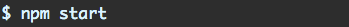

Getting started
==================

Our sample app will be a simple food nutrition lookup table. The data driving the app is supplied by the USDA's National Nutrient Database.

We'll take a look at the working app first. Then we'll strip down the app to just the Node+Express server and build it back up by adding in our React app.

First, git clone the repository:

$ git clone git@github.com:darlzkrish27/react-api-app\

cd into that directory. The layout should look like this:

.. image:: layout1.png

This is where the server lives (aptly, server.js). Inside of the db folder is a sqlite database containing the nutrition data. The package.json in this folder specifies the dependencies for the server.

Peeking into the client directory:

.. image:: layout1.png

Of interest, we have two package.json files in this project — one here and one up top. The client and the server specify their own dependencies independently. For all intents and purposes, they are two completely separate apps that could exist in their own discrete git repos.

Let's install the dependencies for both:

And then we'll be ready to boot from the top-level directory:

Your browser should open localhost:3000 automatically. Behold, the most advanced and nutritious interface V8 has ever rendered:

.. image:: npm-full-food-demo.gif