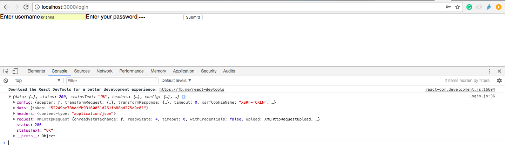

DRF + React
===============
Now let’s hook into our DRF API for real. Our endpoints are at the local host of http://127.0.0.1:8000/.

In our App.js file we’ll load this JSON data into our state before we render any components. We can do this with componentDidMount. Even cooler, we can use async/await so it’s done asynchronously. Then we output it as before, this time only showing the title and not the description from our DRF backend.

But we need to access only the http://localhost:3000/ , it will automatically redirect to the login page.

For Login.js it needs to connect to the login of django api endpoint  'http://localhost:8000/api/login/'

Login.js 
+++++++++++

.. code-block:: javascript

	import React, { Component } from 'react';
	import axios from 'axios';

	class Login extends Component {
	    constructor(){
	        super();
	        this.state = { username: '', password: ''};
	    }

	    onChange = (e) => {
	        // Because we named the inputs to match their corresponding values in state, it's
	        // super easy to update the state
	        const state = this.state
	        state[e.target.name] = e.target.value;
	        this.setState(state);
	      }

	    onSubmit = (e) => {
	        e.preventDefault();
	        // get our form data out of state
	        const { username, password } = this.state;

	        axios.post('http://localhost:8000/api/login/', {
	            username: username,
	            password: password,
	          })
	          .then((response) => {
	            console.log(response);
	            let token =response.data['token'];
	            localStorage.setItem("token", token)
	            this.props.history.replace({pathname: '/App'});     
	          })
	          .catch(function (error) {
	            console.log(error);
	          });
	      }
	    
	    render() {
	        const { username, password } = this.state;
	        return(
	          <form onSubmit={this.onSubmit}>
	            <label htmlFor="username">Enter username</label>
	            <input name="username" type="text" value={username} onChange={this.onChange}/>

	            <label htmlFor="password">Enter your password</label>
	            <input name="password" type="password" value={password} onChange={this.onChange}/>

	            <button type="submit">Submit!</button>
	          </form>
	        );
	      }
	}

	export default Login;

You have to login with the existing user of the django application so that it automatically login into our Django polls app which will give you back the token from this react application. you can see the token in the console of browser.

The token at the key 'data' from the Django polls (backend) server:

