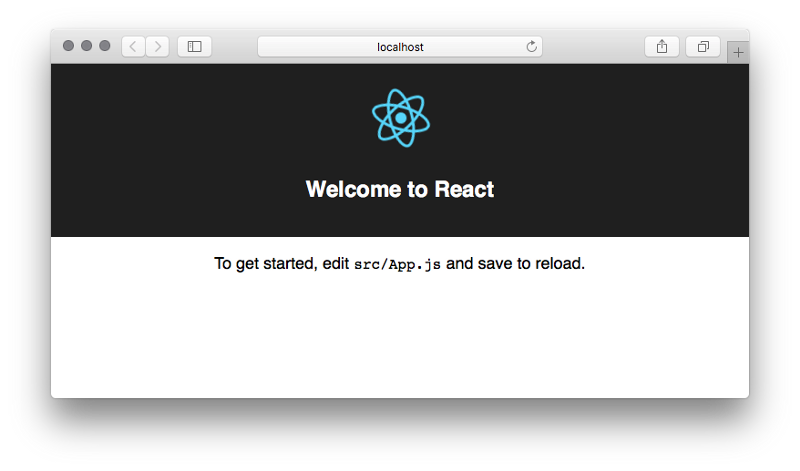
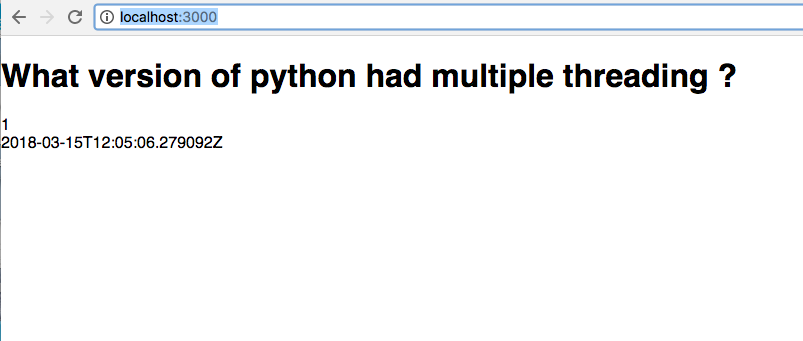

Frontend
===========

We’re using React in this tutorial but our backend doesn’t care what frontend framework is used to consume our polls API. We could just as easily choose Vue, Angular, or something else.

The fastest way to build a new React app is to use the excellent create-react-app which does not require any build configuration. It just works.

Open up a new command line console so there are now two consoles open. Leave our existing backend open and still running our local server for our DRF API.

In the new console install :code:`create-react-app` globally with the following command:

.. code-block:: bash

	$npm install -g create-react-app

Make sure we’re in the correct directory by navigating to the Desktop and then creating a frontend directory

.. code-block:: bash

	$ cd  ~/Desktop
	$ create-react-app frontend
	$ cd frontend

We can now run our React app with the command :code:`npm start`

.. code-block:: bash

	$ npm start

And navigate to http://localhost:3000/

Isn’t that cool?

Since this tutorial is not about React I’m just going to give you the necessary code. We only need to update the :code:`App.js` file.

Our :code:`/api` endpoint is in JSON. Mine looks like this

.. code-block:: json

	{
    "id": 1,
    "choices": [
        {
            "id": 1,
            "votes": [],
            "choice_text": "1.5",
            "poll": 1
        },
        {
            "id": 2,
            "votes": [
                {
                    "id": 1,
                    "choice": 2,
                    "poll": 1,
                    "voted_by": 1
                }
            ],
            "choice_text": "2.0",
            "poll": 1
        },
        {
            "id": 3,
            "votes": [],
            "choice_text": "3.0",
            "poll": 1
        }
    ],
    "question": "What version of python had multiple threading ?",
    "pub_date": "2018-03-15T12:05:06.279092Z",
    "created_by": 1
	}

We can mock that up in our React app in a variable list, load that list into our state, and then use map() to display all the items. Here’s the code.

.. code-block:: javascript

	// App.js
	import React, { Component } from 'react';

	const list = [
	  {
		    "id": 1,
		    "choices": [
		        {
		            "id": 1,
		            "votes": [],
		            "choice_text": "1.5",
		            "poll": 1
		        },
		        {
		            "id": 2,
		            "votes": [
		                {
		                    "id": 1,
		                    "choice": 2,
		                    "poll": 1,
		                    "voted_by": 1
		                }
		            ],
		            "choice_text": "2.0",
		            "poll": 1
		        },
		        {
		            "id": 3,
		            "votes": [],
		            "choice_text": "3.0",
		            "poll": 1
		        }
		    ],
		    "question": "What version of python had multiple threading ?",
		    "pub_date": "2018-03-15T12:05:06.279092Z",
		    "created_by": 1
		}
	];

	class App extends Component {
	  constructor(props) {
	    super(props);
	    this.state = { list };
	  }

	  render() {
	    return (
	      

        {this.state.list.map(item => (
	          

	            <h1>{item.question}</h1>
	            {item.id} 
	            {item.pub_date}
	          

	        ))}
	      

	    );
	  }
	}

	export default App;

you should see our polls app listed out on the hompage at :code:`http://localhost:3000`

