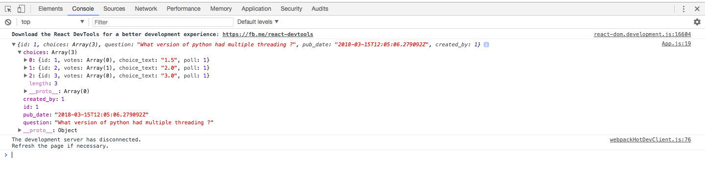

Data from the Django-Polls APP with Authorization
===================================================

The data from the django polls app will be loaded when the react app calls the endpoint 'http://localhost:8000/api/polls/1' but without authentication it won't happen. So, first we have to get the token from :code:`localStorage` and then have to call the api endpoint.
lets see what App.js does 

App.js

.. code:: javascript

	// App.js
	import React, { Component } from 'react';

	class App extends Component {
	  state = {
	    polls: []
	  };

	  async componentDidMount() {
	    try {
	      var token =localStorage.getItem('token')
	      const res = await fetch('http://localhost:8000/api/polls/1',{
	        headers: new Headers({
	          'Authorization' : 'Token'+ token

	        })
	      });
	      const polls = await res.json();
	      console.log(polls)
	      this.State= { polls }
	    } catch (e) {
	      console.log(e);
	    }
	  }

	  render() {
	    return (
	      

	        {this.state.polls.map(item => (
	            <h1>{item.id}</h1>
	        ))}
	      

	    );
	  }
	}

	export default App;

It automatically fetches the data along with the authorization, if not it gets a 405 unauthorized error.

Data from the django server looks like the following:

