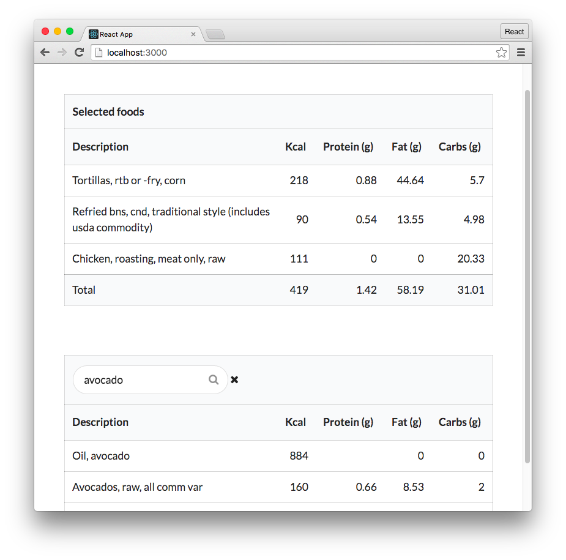

Testing it out
===================

Our React app is ready and in place in client/. We have concurrently setup to boot both our Webpack dev server and our API server together. And we've specified the route that Webpack should proxy API traffic to.

Let's boot both servers:

.. code-block:: bash
	$ npm start
We're in business!

