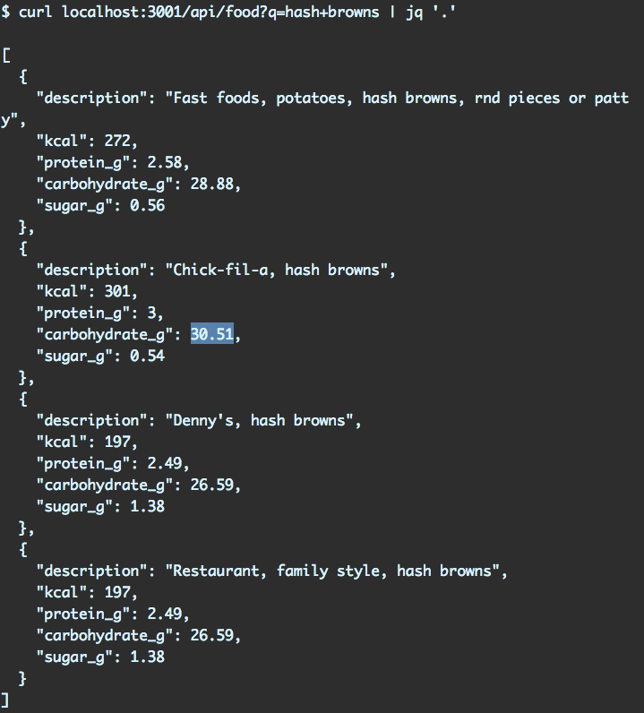

The server
=============

Let's boot the server:

We're only booting up the server as we don't have the client yet. This server provides a single API endpoint, /api/food. It expects a single parameter, q, the food we are searching for.

You can give it a spin. The server is on 3001. You can use curl or your browser. The example below pipes to the tool jq for human readability:

Now that we understand how this endpoint works, let's build the front-end application. Kill the server with CTRL+C.
