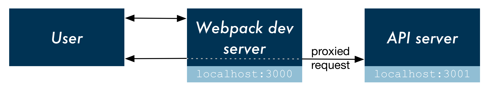

The Rub
===========

Webpack is a JavaScript bundler. You might have many different JavaScript modules, like React components and Redux reducers, strewn across many different files. Webpack rolls these up into one gigantic "bundle." Think of the bundle as a combination of a vanilla index.html that includes a file bundle.js. This JavaScript file is one big, long file with every line of JavaScript that your app depends on, all shoved into one location. This single file will contain browser-ready JavaScript as Babel will have already worked its transpiling magic.

You can instruct Webpack you would like it to produce this bundle. create-react-app inserts a build command into package.json:

.. code-block:: bash
	$ npm run build

This command kicks off Webpack and Webpack spits out a bundle. You could then serve the index.html from that bundle wherever you'd like.

So, we could use Webpack to generate this bundle. And we could have our API server serve the static asset index.html. We'd run the build command inside client/ and out would come the magic build folder. We could then serve this folder with our API server.

And it would work. And we might even be happy about it.

However, there's a better approach: You can have Webpack boot a little Node server to serve the bundle. This means that when you make updates to your JavaScript/assets, you don't have to re-build and re-load — you just hit the server again to get the latest bundle. This workflow enables hot reloading, where your web app will reload itself when assets change, saving your modifier+R keys from a significant amount of wear.

In fact, if you run npm run build you'll find that this command is intended for production use. It does all kinds of optimization that can be time consuming — aggravating when you're quickly iterating in development. Booting a Webpack dev server is the way to go.

So the user will direct their browser to localhost:3000, hitting the Webpack dev server. But then how will the React app communicate with our API server?

Our intuition would be to have a flow like this:

In this flow, the user's browser makes a request to localhost:3000, loading the static assets from the Webpack dev server. The user's browser / React then makes requests as needed directly to the API server hosted on localhost:3001 with calls like this:

.. code-block:: python

	fetch('localhost:3001/api/foods?q=carrots', {
	  // ...
	});

This would produce an issue, however. The React app (hosted at localhost:3000) would be attempting to load a resource from a different origin (localhost:3001). This would be performing Cross-Origin Resource Sharing. The browser prevents these types of requests from scripts for security reasons.

create-react-app provides a mechanism for working with an API server in development. We can have the Webpack development server proxy requests intended for our API server, like this:

In this flow, React makes an API request to localhost:3000, the Webpack development server. And then the development server simply proxies that request to the API server, negating any CORS issues.

So, the Rub: we need to (1) launch both the Webpack dev server and the API server in order to run the app locally. And then (2) we need to get the Webpack dev server to proxy requests intended for our API server.

For the first challenge, we could use two terminal windows: boot each server in its own window. But we could get a bit fancier.

